# WORK BREAKDOWN STRUCTURE (WBS) & FUTURE ROADMAP
## Hệ Thống Đặt Dịch Vụ Cưới AN Wedding

Tài liệu này phân rã toàn bộ cấu trúc tính năng chi tiết đã được xây dựng trong hệ thống **AN Wedding** (Frontend & Backend) và thiết lập lộ trình phát triển các tính năng trong tương lai, đặc biệt là việc tích hợp cổng thanh toán tự động **SePay**.

---

## 📊 Sơ Đồ Cấu Trúc Phân Rã Công Việc (WBS)

```mermaid
graph TD
    Root["AN Wedding Platform"] --> P1["1. Xác thực & Phân quyền"]
    Root --> P2["2. Giao diện & Shell Website"]
    Root --> P3["3. Danh mục & Chi tiết dịch vụ"]
    Root --> P4["4. Cổng thanh toán (Simulated VNPay)"]
    Root --> P5["5. Dashboard cho Nhà cung cấp (Vendor)"]
    Root --> P6["6. Cockpit Quản trị viên (Admin)"]
    Root --> P7["7. Kế hoạch SePay & Tương lai (Roadmap)"]

    P1 --> P1_1["1.1 Đăng ký thành viên (Khách hàng/Vendor)"]
    P1 --> P1_2["1.2 Đăng nhập bằng mã hóa mật khẩu bcrypt"]
    P1 --> P1_3["1.3 Tạo JSON Web Token (JWT) lưu localStorage"]
    P1 --> P1_4["1.4 Phân quyền kiểm soát truy cập (protect & authorize)"]

    P2 --> P2_1["2.1 Trang chủ luxury (Soft Cream, Terracotta, Forest Green)"]
    P2 --> P2_2["2.2 SharedHeader co giãn (Responsive) đa thiết bị"]
    P2 --> P2_3["2.3 Thiết kế Glassmorphism & Hoạt họa vi mô (Micro-animations)"]

    P3 --> P3_1["3.1 Bộ lọc phân loại (Nhà hàng, Xe hoa, Makeup, Áo cưới...)"]
    P3 --> P3_2["3.2 Trang chi tiết dịch vụ: Địa chỉ, SĐT, Facebook, Bản đồ"]
    P3 --> P3_3["3.3 Album ảnh chất lượng cao dạng Carousel"]
    P3 --> P3_4["3.4 Tính năng Book lịch & Bảng tính giá chi tiết"]

    P4 --> P4_1["4.1 Lưu trữ đơn hàng (Order Model) ở trạng thái Chờ duyệt (Pending)"]
    P4 --> P4_2["4.2 Cổng mô phỏng VNPay: Nhập thẻ ATM nội địa & OTP xác nhận"]
    P4 --> P4_3["4.3 Luồng doanh thu trực tiếp chuyển thẳng về Admin"]

    P5 --> P5_1["5.1 Nhập dịch vụ mới (Tên, Giá, Mô tả, Ảnh, Địa điểm...)"]
    P5 --> P5_2["5.2 Quản lý & chỉnh sửa thông tin dịch vụ đã đăng"]
    P5 --> P5_3["5.3 Theo dõi trạng thái đơn đặt của khách hàng"]

    P6 --> P6_1["6.1 Dashboard thống kê tổng quan (Doanh thu, Lượt truy cập...)"]
    P6 --> P6_2["6.2 Biểu đồ doanh thu dạng Cột (Tháng) & Tiến trình (Quý)"]
    P6 --> P6_3["6.3 Duyệt/Từ chối thủ công đơn VNPay (Manual Approval)"]
    P6 --> P6_4["6.4 Quản lý thành viên: Thăng/Hạ quyền, Xóa tài khoản bảo mật"]
```



---

## 📝 Chi Tiết Các Hạng Mục Công Việc (WBS Details)

### 1. Phân Hệ Xác Thực & Phân Quyền (Authentication & Access Control)
* **1.1. Đăng ký tài khoản (`/register`):**
  * Hỗ trợ phân tách vai trò ngay từ khi đăng ký: Khách hàng (Customer) hoặc Đối tác dịch vụ (Vendor).
  * Kiểm tra trùng lặp email và mật khẩu tối thiểu.
* **1.2. Đăng nhập hệ thống (`/login`):**
  * Kiểm tra tài khoản bằng mật khẩu băm (`bcryptjs`).
  * Tạo token JWT thời hạn 30 ngày chứa thông tin `_id` và `role`.
* **1.3. Lưu trữ phiên làm việc:**
  * Đồng bộ Token và User Data vào `localStorage` của trình duyệt.
  * Tự động điều hướng và bảo vệ trang nếu chưa đăng nhập.
* **1.4. Middleware bảo mật Backend (`authMiddleware.js`):**
  * `protect`: Xác thực Bearer Token trong header của yêu cầu API.
  * `authorize('admin', 'vendor')`: Kiểm tra vai trò nghiêm ngặt trước khi truy cập tài nguyên nhạy cảm.

### 2. Phân Hệ Giao Diện & Trải Nghiệm Người Dùng (Aesthetics & Shell UI)
* **2.1. Thiết kế Hệ thống Màu sắc Luxury:**
  * Nền chủ đạo: Soft Cream (`#fbf8f1`).
  * Điểm nhấn ấm áp: Terracotta (`#c3937c`).
  * Biểu tượng thiên nhiên: Forest Green (`#4d5637`).
* **2.2. Responsive Shell:**
  * Shared Header hỗ trợ Drawer Menu trượt trên thiết bị di động (Mobile/Tablet).
  * Responsive lưới (Grid) hiển thị danh sách dịch vụ tiệc cưới.
* **2.3. Hiệu ứng Hoạt họa (Micro-animations):**
  * Nút "Book" và các thẻ dịch vụ có hiệu ứng Hover mềm mại, tăng tỷ lệ nhấp.
  * Lớp phủ mờ (Glassmorphism) tạo cảm giác cao cấp chuẩn tạp chí.

### 3. Phân Hệ Danh Mục & Trang Chi Tiết (Catalog & Detail Pages)
* **3.1. Phân loại dịch vụ cưới hỏi:**
  * Các danh mục lõi: Nhà hàng tiệc cưới (`nha_hang`), Trang điểm cô dâu (`trang_diem`), Xe hoa ngày cưới (`xe_hoa`), Chụp ảnh cưới (`chup_anh`), Váy cưới & Vest (`vay_cuoi`).
* **3.2. Cấu trúc Trang Chi tiết Dịch vụ (`ServiceDetailPage.jsx`):**
  * **Thông tin cơ bản:** Tiêu đề, địa chỉ, rating, số lượng đánh giá, bản đồ định vị.
  * **Liên hệ liên kết:** Số điện thoại, website trực tiếp, nút biểu tượng mạng xã hội Facebook.
  * **Mô tả chi tiết:** Giới thiệu dài kèm danh sách các dịch vụ tặng kèm phong phú.
  * **Album ảnh:** Trình chiếu Carousel ảnh chất lượng cao sắc nét.
  * **Bảng tính giá bên phải:** Hiển thị chi tiết bảng giá các gói (Standard, Premium, Suite) và nút "Thanh toán".

### 4. Phân Hệ Quản Lý Thanh Toán (Simulated Payment Flow)
* **4.1. Khởi tạo đơn đặt hàng (`Order Model`):**
  * Lưu trữ thông tin khách hàng, dịch vụ, các gói đi kèm, tổng tiền và mã tham chiếu giao dịch duy nhất `txnRef`.
  * Trạng thái khởi tạo mặc định: Chờ thanh toán (`pending`).
* **4.2. Giao diện Cổng VNPay Mockup (`VNPayPaymentPage.jsx`):**
  * Hiển thị đếm ngược thời gian thanh toán (15 phút).
  * Hỗ trợ tab Thanh toán qua mã QR (Simulated VietQR) hoặc thẻ ATM nội địa.
  * Form nhập thông tin thẻ mô phỏng kèm cửa sổ xác nhận OTP (`123456`).
* **4.3. Định hướng giao dịch an toàn:**
  * Tiền cọc/thanh toán chạy thẳng về tài khoản Admin để giám sát thay vì chuyển trực tiếp cho Vendor, bảo vệ khách hàng khỏi rủi ro lừa đảo.

### 5. Cockpit Quản Lý Cho Vendor (Vendor Dashboard)
* **5.1. Thêm mới dịch vụ cưới:**
  * Giao diện nhập liệu chuẩn hóa: Tên dịch vụ, danh mục, giá khởi điểm, số điện thoại, link social, mô tả chi tiết, các gói dịch vụ đi kèm.
* **5.2. Quản lý danh sách:**
  * Hiển thị bảng lưới dịch vụ do chính Vendor sở hữu.
  * Chức năng chỉnh sửa thông tin hoặc tạm ẩn/gỡ bỏ dịch vụ.
* **5.3. Giám sát đơn đặt hàng:**
  * Xem danh sách khách hàng đã đặt lịch các gói dịch vụ của mình cùng trạng thái thanh toán từ Admin.

### 6. Cockpit Quản Trị Hệ Thống (Admin Dashboard)
* **6.1. Báo cáo Tổng quan & Thống kê:**
  * Thống kê tổng doanh thu nền tảng, số lượt truy cập (Visits), số lượng đơn đặt (Bookings), và tổng số lượng người dùng.
* **6.2. Trực quan hóa dữ liệu (Charts):**
  * Biểu đồ cột CSS động hiển thị doanh thu theo 12 tháng.
  * Biểu đồ thanh ngang so sánh cơ cấu doanh thu theo Quý (Q1-Q4).
  * Tỷ lệ cơ cấu tài khoản người dùng trên website (Khách hàng vs Đối tác vs Admin).
* **6.3. Quản lý Thành viên:**
  * Xem danh sách chi tiết thành viên hệ thống kèm ngày tạo.
  * Thăng cấp/hạ cấp vai trò thành viên trực tiếp (Customer ⇄ Vendor ⇄ Admin).
  * Chặn/Xóa vĩnh viễn tài khoản (được bảo vệ ngăn tự xóa tài khoản chính mình).
* **6.4. Phê duyệt & Cập nhật đơn đặt VNPay:**
  * Xem danh sách đơn hàng toàn sàn kèm mã tham chiếu giao dịch.
  * Nút "Phê duyệt" (Duyệt thủ công đơn hàng đã nhận tiền) và "Từ chối" (Huỷ đơn thanh toán lỗi) và "Hoàn chuyển/Đặt lại".

---

## 🚀 Kế Hoạch Tích Hợp Cổng Thanh Toán SePay (SePay Integration Plan)

Tích hợp **SePay** là bước chuyển đổi cốt lõi từ cổng thanh toán mô phỏng (Mockup) sang hệ thống **quét mã VietQR tự động xác nhận giao dịch thời gian thực** (Real-time Payment Confirmation).

### 🛠️ Nguyên lý hoạt động của SePay
```
[Khách hàng] --- (Quét mã VietQR động) ---> [Chuyển khoản Ngân hàng]
                                                    |
                                          (Ngân hàng báo có)
                                                    |
                                                    v
[Backend Node.js] <--- (Gửi Webhook API) --- [Hệ thống SePay]
         |
  (Khớp mã txnRef & amount)
         |
  (Chuyển trạng thái Order -> completed)
         |
         v
[Frontend React] <--- (Tự động chuyển trang) --- [Trang SUCCESS]
```

### 📋 Kế hoạch chi tiết phân rã tích hợp SePay (WBS Phase 7)
* **7.1. Cấu hình Tài khoản SePay:**
  * Kết nối tài khoản ngân hàng nhận tiền (Admin) vào SePay.vn.
  * Thiết lập cấu hình ứng dụng trên SePay Dashboard để nhận thông tin chuyển khoản.
* **7.2. Tạo Mã VietQR Động Phía Frontend (`FE`):**
  * Thay thế giao diện thẻ VNPay bằng giao diện hiển thị VietQR theo định dạng chuẩn Napas:
    `https://img.vietqr.io/image/<BANK_ID>-<ACCOUNT_NO>-qr_only.png?amount=<AMOUNT>&addInfo=<txnRef>&accountName=<ACC_NAME>`
  * Hiển thị hướng dẫn khách hàng quét mã, nhấn mạnh không được thay đổi **Nội dung chuyển khoản** (Chứa mã giao dịch `txnRef` ví dụ: `ANW17283921`).
* **7.3. Phát Triển Webhook API Phía Backend (`BE`):**
  * Tạo Endpoint nhận yêu cầu Webhook từ SePay: `POST /api/payments/sepay-webhook`.
  * Xác thực độ bảo mật của yêu cầu bằng API Key (X-API-Key) hoặc Token bảo mật của SePay.
  * Đọc nội dung chuyển khoản (`code` / `description`), trích xuất mã giao dịch `txnRef`.
  * So khớp số tiền nhận được với số tiền đơn hàng trong database.
  * Cập nhật trạng thái đơn đặt từ `pending` sang `completed` và ghi nhận `paymentDate`.
* **7.4. Đồng bộ Real-time Frontend bằng Cơ chế Long Polling/Websocket:**
  * Phía Frontend trang thanh toán, thiết lập cơ chế kiểm tra tự động trạng thái đơn hàng (Polling) mỗi 3-5 giây gọi `/api/payments/status/:txnRef`.
  * Khi nhận thấy trạng thái đã chuyển thành `completed` nhờ Webhook SePay xử lý, tự động chuyển hướng khách hàng đến trang `/payment/success` mà không cần khách hàng tự bấm nút xác nhận nào.

---

## 🔮 Lộ Trình Phát Triển Trong Tương Lai (Long-term Roadmap)

### 📈 Phase 8: Hệ Thống Đánh Giá & Tương Tác Nâng Cao
* **8.1. Đánh giá đa chiều (Multi-dimension Review):**
  * Cho phép khách hàng đã sử dụng dịch vụ viết bài đánh giá kèm chấm điểm theo tiêu chí: Giá cả, Thái độ phục vụ, Chất lượng thực tế.
  * Đính kèm hình ảnh thực tế đám cưới vào đánh giá.
* **8.2. Kênh chat trực tiếp (Direct Message - Socket.io):**
  * Tạo khung chat trực tiếp giữa Cô dâu/Chú rể và Vendor để thảo luận chi tiết gói dịch vụ, thay vì chỉ hiển thị SĐT/Facebook.

### 📅 Phase 9: Quản Lý Lịch Trình & Tự Động Hóa (Scheduler)
* **9.1. Lịch đặt chỗ tự động (Booking Calendar):**
  * Cho phép Vendor đánh dấu những ngày đã bận lịch (đã có đám cưới khác book).
  * Khách hàng chỉ được chọn những ngày còn trống trên lịch của dịch vụ đó, tránh xung đột lịch trình (Double Booking).
* **9.2. Hệ thống nhắc lịch tự động:**
  * Tự động gửi Email/SMS nhắc nhở khách hàng và Vendor trước ngày cưới 3 ngày, 1 ngày.

### 🔔 Phase 10: Thông Báo Tức Thời (Real-time Notifications)
* **10.1. Trung tâm thông báo (Notification Center):**
  * Admin nhận thông báo ngay khi có đơn book mới hoặc có dịch vụ mới chờ duyệt.
  * Vendor nhận thông báo khi đơn hàng của họ được Admin phê duyệt giải ngân.
  * Khách hàng nhận thông báo khi trạng thái đơn book chuyển khoản của họ được duyệt thành công.

### 📱 Phase 11: Ứng Dụng Di Động (Mobile Application)
* **11.1. AN Wedding App:**
  * Phát triển ứng dụng di động Hybrid (React Native) dành cho Khách hàng tìm kiếm dịch vụ tiện lợi hơn.
  * Ứng dụng quản trị riêng biệt cho Vendor quản lý lịch chụp ảnh, trang điểm, xe hoa ngay trên điện thoại thông minh.
